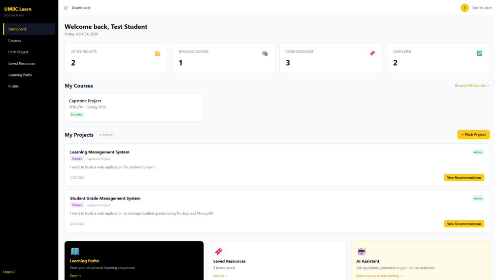
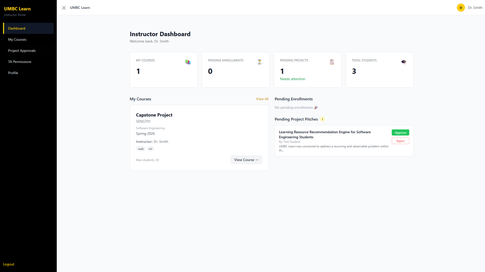
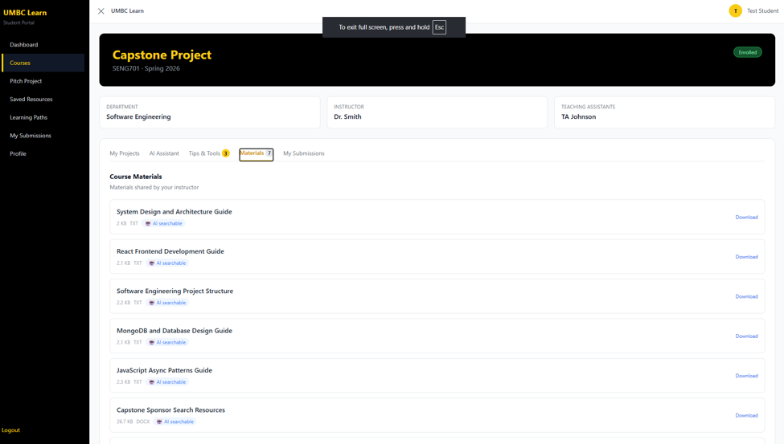

# UMBC Learn — Learning Resource Recommendation Engine

A course-material-first learning resource recommendation
platform for software engineering students at UMBC.
Built as a graduate Capstone project for SENG 701,
Spring 2026.

**Live Application:**
https://umbc-learning-resource-recommendation.vercel.app

**Backend API:**
https://umbc-learn-server.onrender.com

**Health Check:**
https://umbc-learn-server.onrender.com/api/health

---

## Overview

UMBC Learn helps students find relevant resources for
their course projects by grounding all recommendations
and AI responses in what their instructor actually
uploaded — not generic internet content.

Key features:
- AI chat powered by Gemini 2.5 Flash using RAG
  grounded in course materials and instructor tips
- Four-source recommendations: course materials,
  instructor tips, YouTube videos, GitHub repos
- Instructor Tips system for sharing course-specific
  knowledge without file uploads
- Data privacy controls — per-course and per-material
  AI processing toggles
- Grading and submission system with file upload
- Email notifications for all key academic events
- Five-role hierarchy: Admin, Department Head,
  Instructor, Teaching Assistant, Student
- 14 MongoDB collections, 50+ API endpoints

---

## Problem & Solution

Software engineering students often don't know where to find relevant resources when starting course projects. Generic AI tools like ChatGPT pull answers from the entire internet rather than from what the professor actually taught. UMBC Learn fixes this by putting instructor-uploaded content first — the AI assistant searches course materials before answering, so students get responses grounded in their actual course content.

## Project Stats
- ~15,000 lines of JS/JSX across 124 source files
- 60 Git commits across Alpha, Beta, and Final checkpoints
- 14 MongoDB collections
- 50+ REST API endpoints
- 5 user roles with dedicated dashboards
- Built solo over one semester (Spring 2026)

## Screenshots

**Student Dashboard**


**Instructor Dashboard**


**Course Details — Students, Projects, Materials, and AI Assistant tabs**


---

## Tech Stack

| Layer | Technology |
|-------|------------|
| Frontend | React 18 + Vite + Tailwind CSS |
| Backend | Node.js + Express.js |
| Database | MongoDB Atlas + GridFS |
| Auth | JWT + bcrypt + Google OAuth 2.0 |
| AI | Google Gemini 2.5 Flash |
| Video API | YouTube Data API v3 |
| Code API | GitHub Search API |
| Email | Nodemailer + Gmail SMTP |
| Frontend Deploy | Vercel |
| Backend Deploy | Render |

---

## Local Setup

### Requirements
- Node.js 18+
- MongoDB Atlas account (free M0 tier)
- Gmail account with App Password
- Google Cloud Console account (YouTube API + OAuth)
- Google AI Studio account (Gemini API key)

### Backend

```bash
cd server
npm install
```

Create `server/.env` with these variables:

```
PORT=5000
MONGODB_URI=your_mongodb_atlas_connection_string
JWT_SECRET=your_jwt_secret_key
JWT_EXPIRES_IN=7d
GOOGLE_CLIENT_ID=from_console.cloud.google.com
GOOGLE_CLIENT_SECRET=from_console.cloud.google.com
GOOGLE_CALLBACK_URL=http://localhost:5000/api/auth/google/callback
EMAIL_USER=your_gmail@gmail.com
EMAIL_APP_PASSWORD=your_16_char_app_password
EMAIL_FROM=UMBC Learn <your_gmail@gmail.com>
GEMINI_API_KEY=from_aistudio.google.com
YOUTUBE_API_KEY=from_console.cloud.google.com
FRONTEND_URL=http://localhost:5173
```

```bash
node data/seed.js
node data/seedPublicMaterials.js
node index.js
```

Server runs at http://localhost:5000

### Frontend

```bash
cd client
npm install
```

Create `client/.env`:

```
VITE_API_BASE_URL=http://localhost:5000/api
```

```bash
npm run dev
```

Frontend runs at http://localhost:5173

---

## Demo Access

Contact me at shouryarami@gmail.com for demo credentials or use the seed scripts to set up locally.

---

## Project Structure

```
client/
  src/
    api/          Axios API functions
    components/   Reusable UI components
    context/      AuthContext, UIContext
    pages/        All page components by role
server/
  config/         Database, mailer, passport setup
  data/           Seed scripts and demo data utilities
  middleware/     Auth and role check middleware
  models/         14 Mongoose models
  routes/         All API route handlers
  utils/          Gemini, YouTube, GitHub, materialSearch
  index.js
```

---

## Branches

| Branch | Description |
|--------|-------------|
| main | Production — auto-deploys to Vercel and Render |
| alpha | Frozen Alpha Checkpoint (April 1, 2026) |
| beta | Frozen Beta Checkpoint (April 23, 2026) |
| final | Final Checkpoint development (commits 42-59) |

---

## Capstone Information

- **Student:** Shourya Rami (AD39491)
- **Program:** MPS Software Engineering, UMBC
- **Course:** SENG 701 Capstone in Software Engineering
- **Term:** Spring 2026
- **Advisors:** Dr. Mohammad Samarah and Prof. Melissa Sahl

---

## Demo Data Setup

To reset to a clean demo environment:

```bash
cd server
node data/clearForDemo.js
node data/seed.js
node data/seedPublicMaterials.js
```
